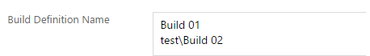
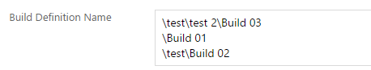
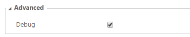

# Visual Studio Team Services - Queue Build(s) Task
This task can be used for release or build definitions to queue further builds. With one task configuration you can start several builds.
By the use of the async setting the task is also able to wait for all builds to be finished.

# Configuration

**Build Definition Name**
The path to your build definitions.

* Single build

A build definition is simply queued by its name.

* Multiple builds

Multiple definitions are separated by a new line.

* Subfolders

Folders are separated by a backslash. The starting backslash is optional. Subfolder can also be used for single builds.

**Async**

The async flag defines whether the build task waits till the builds are finished or just queues them.

**Debug**

Enables the debug mode. Additional information about your build definitions and the processed input will be provided.

# Further information
If you need some special kind of setting or a new feature for this extension, don't hesitate to create a github issue or leave a comment at the vsts extension page.
https://marketplace.visualstudio.com/items?itemName=jb.queue-build (coming soon)
