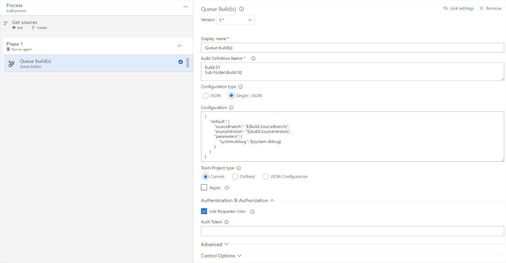
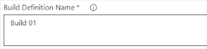

# Visual Studio Team Services - Queue Build(s) Task  
**Build & Release task to queue further builds**

**Features:**
* Queue one or multiple builds at the same time
* Define build specific parameters
    * Branch
    * Commit version
    * Build parameters
* Queue builds async
* Configurable authentication
* Team project indepentent queuing
* Build & Releas summary

  
A simple task configuration to start several builds with the same variables.  
At the end you find all queued builds in the summary page of your build or release.

 

# Settings

**Build Definition Name**  
The path to your build definitions. Supports:
* Single build
* Multiple builds
* Subfolders
* Comments

Detailed documentation on Github: [Build Definition Name](https://github.com/bamminger/vsts-queue-build/blob/master/doc/build-definition.md)

---

**Configuration**  
You can use the configuration field to configure the variables per build:
* Shared parameters
* Team project
* Branch
* Commit version
* Build parameters  

Detailed documentation on Github: [Configuration](https://github.com/bamminger/vsts-queue-build/blob/master/doc/configuration.md)

---

**Team project**  
Use the build or release team project, define it on your own or specify it within the configuration setting.

Detailed documentation on Github: [Team project](https://github.com/bamminger/vsts-queue-build/blob/master/doc/team-project.md)

---

**Authentication & Authorization**  
Use a custom authentication token and define whether the current user should be used to queue the new builds.

Detailed documentation on Github: [Authentication](https://github.com/bamminger/vsts-queue-build/blob/master/doc/authentication.md)

---
 
**Troubleshooting**  
Enable the debug mode. Additional information about your build definitions and the processed input will be provided.  

# Further information

If you need some special kind of setting or a new feature for this extension, don't hesitate to create a github issue or leave a comment at the vsts extension page.
https://marketplace.visualstudio.com/items?itemName=jb.queue-build  

Please leave a review in the marketplace with your feedback.

## Donation  
If you like my work, please consider buying me a coffee
<link href="https://fonts.googleapis.com/css?family=Cookie" rel="stylesheet"><a class="bmc-button" target="_blank" href="https://www.buymeacoffee.com/bamminger">Buy me a coffee</a>

