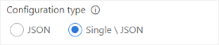

**Authentication & Authorization**

* Use Requestor User  
This setting controls whether the user who has triggered this build or release is used for triggering the new build or the default collection service account.

* Auth Token  
This input field makes it possible to define a custom authentication token, if the default behavior of this task does not work.  
If this field is empty, the tasks tries to use the authentication token of the build agent or the system.accesstoken variable which can be enabled in the build settings.

