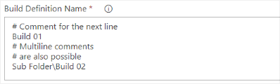

**Build Definition Name**

The path to your build definitions.

* Single build  
A build definition is simply queued by its name.  

* Multiple builds  
Multiple definitions are separated by a new line.  

* Subfolders  
Folders are separated by a backslash. The starting backslash is optional. Subfolders can also be used for single builds.  

* Comments  
Comments are defined by starting a line with #.  

