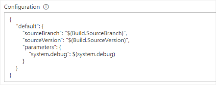

# Configuration

You can use the configuration field to configure the variables per build:




*Syntax (global)*:
```json
{
    "sourceBranch": "value",
}
```

*Syntax (per build)*:

The "default" configuration will be used for all unspecified builds.
All the other builds will be associated by their build name or path + buildname.
```json
{
    "default": {
        "sourceBranch": "value",
    },
    "BUILDNAME": {
        "sourceBranch": "value",
    }
}
```

*Possible settings*:

It is possible to use all supported [VSTS / TFS api](https://www.visualstudio.com/en-us/docs/integrate/api/build/builds#queue-a-build) settings.
Currently tested configuration settings:

```json
{
    "sourceBranch": "value",
    "sourceVersion": "value",
    "parameters": {
        "parameterName": "value"
    },
    "demands": [
        "customExists",
        "customValue -equals value"
    ]
}
```

# Configuration type

* JSON  
The content of the configuration field will be interpreted as JSON.

* Single \\ JSON  
Before the configuration content is interpreted as JSON, all backslash (\\) occurrences are replaced by \\\\. This is necessary to process file paths (e.g. \\\\remote\\folder).  


# Async

The async flag defines whether the build task waits till the builds are finished or just queues them.


