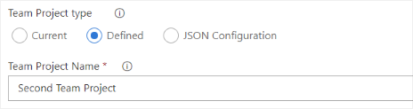

**Team project**  

The following settings are available to configure the team project.

* Current  
This setting uses the team project where the build or release definition are defined.  

* Defined  
When "Defined" is selected a new text field appears, where the team project to use must be entered.

* JSON Configuration  
The JSON option allows you to specify the team project within the build configuration.  
A new field called "teamProject" has to be added to the configuration of the build.  

